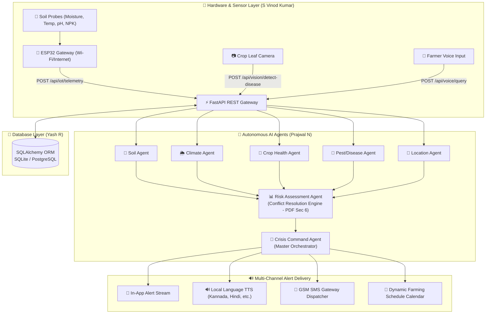

# AgriCrisis Command: FastAPI Multi-Agent Backend

> **GATEWAYS 2026 | Round 1 Ideation & Architecture Implementation**  
> **Team Name:** Team Titans  
  
---

## 🏗️ Backend System Architecture

The backend is built with **Python 3.13**, **FastAPI**, and **SQLAlchemy ORM** (supporting SQLite and PostgreSQL/Firebase), connecting real-time IoT sensors (ESP32) and the frontend React application with 7 specialized autonomous AI agents.



---

## 📡 REST API Endpoints Specification

### 1. Farmer Registration & Profile (Req 1)
- `GET /api/farmer/profile`: Retrieve registered farmer profile and farm boundaries.
- `POST /api/farmer/profile`: Create or update farmer details (Name, Contact, Soil type, Crops, ESP32 device ID, Language).

### 2. IoT Soil Telemetry (Req 2)
- `POST /api/iot/telemetry`: ESP32 sensor telemetry ingestion (Moisture %, Soil Temp °C, pH, NPK).
- `GET /api/iot/telemetry/latest`: Latest telemetry reading for live gauges.
- `GET /api/iot/telemetry/history`: 24-hour sensor telemetry points for real-time charting.

### 3. Climate & Weather Monitoring (Req 3)
- `GET /api/weather/current`: Real-time weather parameters and 7-day agricultural forecast.
- `GET /api/weather/alerts`: Extreme weather warning alerts (e.g. 48mm storm warning within 4h).

### 4 & 5. Crop Disease & Pest Detection (Req 4, Req 5)
- `POST /api/vision/detect-disease`: CNN foliage inference on uploaded crop photos (Tomato Early Blight, Rice Blast, Healthy Leaf) with symptoms, organic remedies, and safe chemical treatments.
- `GET /api/vision/pest-surveillance`: Pest infestation assessment (Aphids, Fall Armyworm), biological controls, and barrier crop advice.

### 6. Multi-Agent AI System (Req 6)
- `POST /api/agents/deliberate`: Triggers a full coordination cycle among all 7 specialized AI agents and returns real-time deliberation logs.

### 7 & 8. Crisis Detection & Risk Assessment (Req 7, Req 8)
- `GET /api/crisis/status`: Active crisis state, composite risk severity score (1–100), and confidence rating.
- `POST /api/crisis/escalate`: Human-in-the-loop escalation to Krishi Vigyan Kendra (KVK) Agricultural Extension Officer.
- **Section 6 Conflict Resolution Engine:** Reconciles conflicting data when Soil Sensor indicates dry soil (calls for water) while Climate Agent predicts a 48mm storm (calls for drainage) → Overrides pump activation to prevent crop root hypoxia.

### 9. Multilingual Voice Assistant (Req 9)
- `POST /api/voice/query`: Natural language query processing in **Kannada (ಕನ್ನಡ), Hindi (हिंदी), English, Telugu (తెలుగు), Tamil (தமிழ்), and Marathi (मराठी)**.

### 10. Multi-Channel Alert System (Req 10)
- `GET /api/alerts/recent`: Dispatched alerts history.
- `POST /api/alerts/dispatch-sms`: Dispatches emergency alert SMS to farmer's mobile phone.

### 11. Dynamic Farm Scheduling (Req 11)
- `GET /api/schedule/`: Dynamic calendar tasks (Irrigation, Spraying, Fertilizing, Drainage) auto-scheduled based on weather and soil telemetry.
- `POST /api/schedule/item`: Add a custom farm activity.
- `PATCH /api/schedule/item/{item_id}/toggle`: Mark activity complete or pending.

---

## 🚀 How to Run the Backend Server

```bash
cd "c:\Users\Hari Krishna G\OneDrive\Desktop\vin\backend"
python run_server.py
```

- **Interactive Swagger Documentation:** Open [http://localhost:8000/docs](http://localhost:8000/docs) in your browser.
- **Redoc Documentation:** [http://localhost:8000/redoc](http://localhost:8000/redoc)
