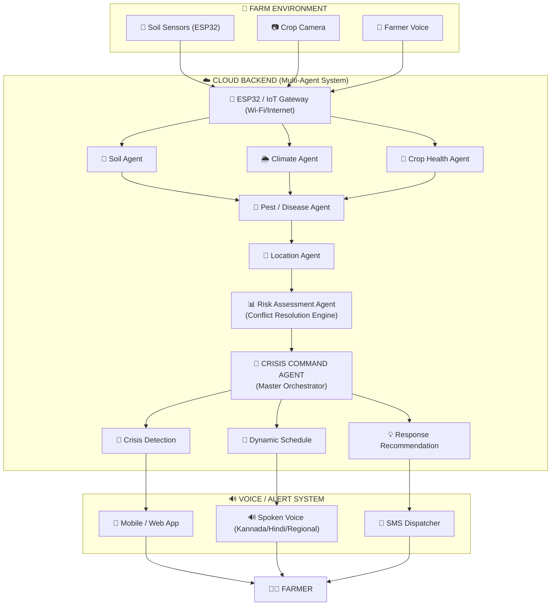

# AgriCrisis Command: AI-Powered Multi-Agent Agricultural Crisis Command System

> **GATEWAYS 2026 | Round 1 Ideation & Architecture Document Implementation**  
> **Team Name:** Team Titans  
> **Team Members:**  
> - **S VINOD KUMAR** (`U03NE24S0029`) — Front end, IoT & sensor connectivity  
> - **PRAJWAL N** (`U03NE24S0024`) — Backend & AI processing  
> - **YASH R** (`U03NE24S0037`) — Database connectivity & storage  

---

## 📌 Problem Statement & Overview
Develop a multi-agent AI-powered Agricultural Crisis Command System that detects, assesses, and coordinates responses to agricultural crises such as pest and disease outbreaks, drought, flooding, extreme weather, and soil-related emergencies. The system combines ESP32 soil-sensor telemetry, weather API data, farmer voice reports, and crop foliage images to identify emerging threats and provide timely, localized voice alerts and response recommendations to affected farmers.

---

## 🚀 All 12 Requirements Mapped & Implemented

| No. | Requirement | Implementation in Frontend | Code Module |
|---|---|---|---|
| **1** | **Farmer registration** | Farmers can register and manage their farm profile (Name, Phone, Farm Title, Region, Farm Size in Acres, Soil Type, Irrigation Method, Crops, ESP32 Serial ID). | `FarmerRegistration.jsx` / `openFarmerProfileModal()` |
| **2** | **Soil monitoring** | Real-time ESP32 IoT telemetry dashboard: Soil Moisture (%), Soil Temperature (°C), Soil pH, and NPK nutrients with interactive live simulator sliders and Chart.js 24h history. | `SoilMonitoring.jsx` / `soilTelemetryChart` |
| **3** | **Weather monitoring** | Displays live weather, 7-day agricultural forecast, precipitation probability, humidity, and extreme weather banners (e.g. 48mm storm warning). | `WeatherMonitoring.jsx` / `tab-weather` |
| **4** | **Crop disease detection** | Image upload scanner with laser animation and benchmark cases (Tomato Early Blight, Rice Blast, Healthy Leaf). Provides confidence %, symptoms, organic remedies, and chemical controls. | `CropDiseaseDetection.jsx` / `tab-vision` |
| **5** | **Pest detection** | Surveillance for Fall Armyworm and Aphid clusters. Displays pest threat ratings, safe biological controls, and marigold trap crop guidance. | `PestDetection.jsx` / `pestAdvice` |
| **6** | **AI agents** | 7 Autonomous AI agents orchestrated in real-time as designed in the PDF Architecture diagram (Soil Agent, Climate Agent, Crop Agent, Pest Agent, Location Agent, Risk Agent, Crisis Command Agent). Includes live inter-agent message bus logs. | `AIAgentsCommand.jsx` / `tab-agents` |
| **7** | **Crisis detection** | Dynamic threat identification for Drought Shock (moisture < 20%), Flash Flooding (moisture > 85% or rainfall > 40mm), and Crop Outbreaks with urgency banners. | `CrisisDetection.jsx` / `triggerPresetCrisis()` |
| **8** | **Risk assessment** | Risk severity scoring (1-100) and confidence rating (92%). Features the **Conflict Resolution Engine** specified in PDF Section 6 (Soil sensor reports dry, but Climate forecasts storm -> Irrigation delayed to prevent root hypoxia) + Human-in-the-loop expert escalation to KVK Agronomist. | `RiskAssessment.jsx` / `escalateToExpert()` |
| **9** | **Voice assistant** | Multilingual voice assistant utilizing Web Speech API (STT via microphone + TTS speech synthesis) with audible voice playback in **Kannada (ಕನ್ನಡ), Hindi (हिंदी), English, Telugu (తెలుగు), Tamil (தமிழ்), and Marathi (मराठी)**. | `VoiceAssistant.jsx` / `toggleSpeechRecognition()` |
| **10** | **Alert system** | Multi-channel crisis alert delivery: In-App emergency alert bar, audible spoken warning, and simulated GSM/SMS smartphone simulator with unread counter and dispatch logs. | `AlertSystem.jsx` / `openSmsModal()` |
| **11** | **Farm scheduling** | Dynamic AI-driven farming calendar (Irrigation, Spraying, Fertilizing, Drainage clearing) that automatically adjusts based on weather predictions and soil moisture. | `FarmSchedule.jsx` / `tab-schedule` |
| **12** | **Location tracking** | Interactive OpenStreetMap (via Leaflet.js) showing farm polygon boundary (4.5 Acres), ESP32 IoT node marker, and color-coded crisis hazard radii (River flood zone, East pest cluster). | `LocationTracking.jsx` / `tab-map-view` |

---

## 🏗️ System Architecture (From PDF Page 3 & 4)



---

## 💻 Running the Connected Full Stack (Frontend + Backend)

Both services are integrated and running concurrently:

### 1. Python FastAPI Backend (Port 8000)
- **API Server:** `http://localhost:8000`
- **Swagger Documentation:** [http://localhost:8000/docs](http://localhost:8000/docs)
- **Redoc Documentation:** [http://localhost:8000/redoc](http://localhost:8000/redoc)
- To run or restart manually:
  ```bash
  cd "backend"
  python run_server.py
  ```

### 2. Frontend Application (Port 3000)
- **URL:** [http://localhost:3000](http://localhost:3000)
- Features a live status badge: **`🟢 FastAPI: Connected (Port 8000)`**.
- Every action on the frontend (slider changes, voice queries, farmer profile updates, task toggling, and multi-agent coordination) automatically calls the FastAPI REST backend and updates the SQLite database!


## 🌟 Key Edge Cases Handled (PDF Section 6)
- **Soil Dry vs Rain Inbound Conflict:** When soil sensor reads 28% moisture (signaling need for water), but Climate Agent predicts 48mm heavy rainfall in 4 hours, the **Risk Assessment Agent** overrides the pump to avoid waterlogging and root rot.
- **Illiterate Farmer Voice Accessibility:** Full regional speech recognition and voice synthesis ensures farmers who cannot read complex sensor gauges can speak naturally and hear actionable guidance in their native tongue.
- **Human-In-The-Loop Escalation:** When confidence level drops below safe thresholds, telemetry and crop imagery are automatically packaged and escalated to the local Krishi Vigyan Kendra (KVK) agricultural scientist.
